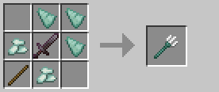

# Đinh ba

Đinh ba là vũ khí đặc biệt có thể chế tạo được, yêu cầu mở khóa kỹ năng Rèn Biển trong cây kỹ năng Rèn.

### Công thức chế tạo

## Yêu cầu

:::warning Yêu cầu kỹ năng
Để chế tạo đinh ba, bạn cần mở khóa kỹ năng **Rèn Biển** trong cây kỹ năng [**Rèn**](../Skills/smithing).
:::

## Thông số

Đinh ba có các thông số giống như đinh ba vanilla của Minecraft:

| Thuộc tính | Giá trị |
|------------|---------|
| **Sát thương** | 9.0 |
| **Tốc độ tấn công** | 1.1 |
| **Tầm tấn công** | 3.0 |
| **Có thể ném** | ✅ |
| **Hoạt động dưới nước** | ✅ |
