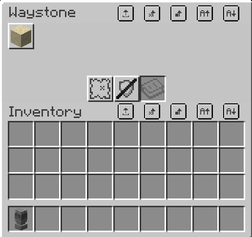
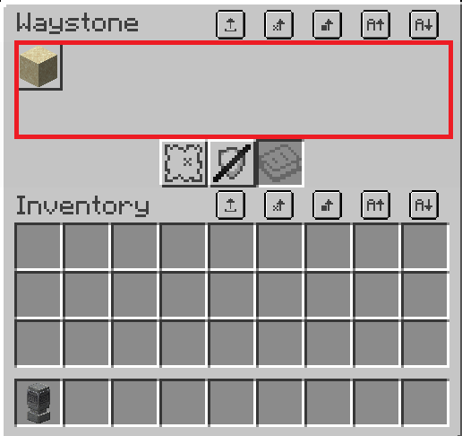
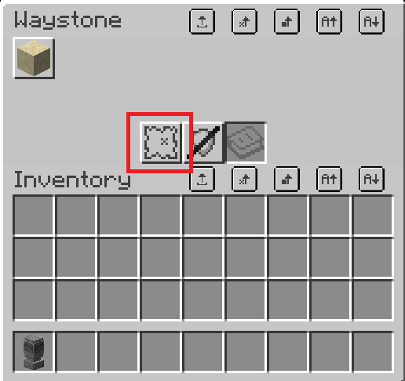
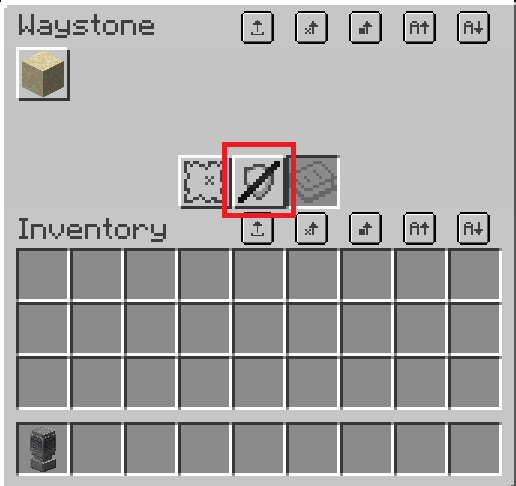
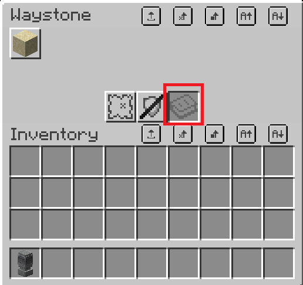

# Waystone

## Giới thiệu

Waystone là vật phẩm giúp bạn di chuyển nhanh và tiện lợi giữa các khoảng cách khổng lồ trong chớp mắt

## Cách chế tạo

Waystone có nhiều phiên bản (như hình trên) và mỗi phiên bản có 1 cách chế tạo khác nhau.
Những nguyên liệu cơ bản bao gồm:

- 1x Mắt Ender
- 2x Amethyst
- 1x Lodestone
- Và 3x Block tuỳ chọn

---

## Cách sử dụng

Sau khi chế tạo xong, đặt xuống và chuột phải để mở menu

:::tip Mẹo
Block ở **phía dưới** waystone sẽ là **icon** của waystone được hiện trên Menu

Bạn có thể **rename** cho vật phẩm waystone trước khi đặt xuống để waystone có **tên riêng** trong menu
:::

### Dịch chuyển

Bạn có thể vào các icon ở 2 dòng đầu tiên để chọn và dịch chuyển đến waystone đó

### Chế độ hiển thị

Waystone có 3 chế độ hiển thị chính:

| Tên             | Mô tả                                                                                                                 |
| --------------- | --------------------------------------------------------------------------------------------------------------------- |
| 🌍 Discoverable | Khi người chơi khác bấm vào waystone của bạn, họ sẽ _phát hiện_ waystone của bạn và sau này có thể dịch chuyển đến đó |
| 🚫 Private      | Chỉ có bạn mới có thể dịch chuyển đến waystone này                                                                    |
| 🧑‍🤝‍🧑 Public       | Mọi người đều có thể dịch chuyển đến waystone này                                                                     |

Bạn có thể thay đổi chế độ hiển thị bằng nút bên dưới

### Bảo vệ

> Waystone có chế độ **bảo vệ** tránh waystone bị **đập** bởi người chơi hoặc các tác nhân bên ngoài

Bạn có thể **bật / tắt** chế độ bảo vệ bằng nút bên dưới

### Chia sẻ

:::warning Lưu ý
Chỉ hoạt động khi chế độ hiển thị đặt sang **Private**
:::

Để **chia sẻ** waystone cho người khác, bạn hãy **đặt** vào một quyển sách **(Book & Quill)** với **mỗi trang** ghi một tên người chơi vào ô dưới đây

