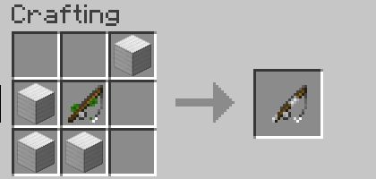

# Cần câu

Cần câu là công cụ chính để câu cá trong máy chủ. Mỗi loại cần câu có những đặc tính và hiệu ứng riêng biệt, phù hợp với các phong cách câu cá khác nhau.

:::tip Cách sử dụng

1. **Trang bị cần câu**: Cầm cần câu trong tay chính
2. **Sử dụng mồi câu**: Cầm mồi câu trong tay phụ (nếu có)
3. **Trang bị lưỡi câu**: Kéo thả lưỡi câu vào cần câu (nếu có)
4. **Câu cá**: Nhấp chuột phải để ném câu, nhấp chuột phải lại khi có cá cắn câu
   :::

---

## Cần Câu Người Mới Bắt Đầu

Được thiết kế đặc biệt cho những người mới làm quen với hệ thống câu cá trong máy chủ.

| Thuộc tính        | Giá trị                                 |
| ----------------- | --------------------------------------- |
| **Độ bền tối đa** | 64                                      |
| **Hiệu ứng**      | Tăng thời gian chờ x1.5, Giảm độ khó -8 |

## Cần Câu Bạc

Được chế tác một cách trang nhã với lớp hoàn thiện lấp lánh, là giấc mơ của mọi thợ câu tìm kiếm cá chất lượng sao bạc.

| Thuộc tính        | Giá trị                            |
| ----------------- | ---------------------------------- |
| **Độ bền tối đa** | 96                                 |
| **Hiệu ứng**      | Tăng cơ hội câu được cá sao bạc +8 |

## Cần Câu Vàng

Lấp lánh dưới ánh nắng mặt trời và toả ra hào quang xa hoa, là đỉnh cao của thiết bị câu cá cao cấp.

| Thuộc tính        | Giá trị                             |
| ----------------- | ----------------------------------- |
| **Độ bền tối đa** | 80                                  |
| **Hiệu ứng**      | Tăng cơ hội câu được cá sao vàng +3 |

## Cần Câu Ngôi Sao (Bonus)

Được chạm khắc từ bụi sao và tắm trong năng lượng vũ trụ, đại diện cho những điều kỳ diệu của vũ trụ.

| Thuộc tính        | Giá trị                 |
| ----------------- | ----------------------- |
| **Độ bền tối đa** | 128                     |
| **Hiệu ứng**      | +15 giây thời gian chơi |

## Cần Câu Xương

Được rèn từ xương của những bộ xương cổ xưa và thấm ướt với phép thuật đen. Cho phép câu cá trong dung nham nóng bỏng.

| Thuộc tính        | Giá trị                                  |
| ----------------- | ---------------------------------------- |
| **Độ bền tối đa** | 32                                       |
| **Hiệu ứng**      | Câu cá trong dung nham, Thu hút Skeleton |

## Cần Câu Ma Thuật

Một sản phẩm của sự đổi mới bí ẩn, sử dụng sách phù phép làm mồi và tiêu tốn cấp độ kinh nghiệm.

| Thuộc tính        | Giá trị                                       |
| ----------------- | --------------------------------------------- |
| **Độ bền tối đa** | 16                                            |
| **Yêu cầu**       | 30 cấp độ kinh nghiệm, 1x mồi sách            |
| **Hiệu ứng**      | Câu được sách phù phép, Thời gian chờ rất lâu |

## Cần Câu Bậc Thầy

Chỉ được sử dụng bởi những thợ câu khéo léo nhất, đại diện cho đỉnh cao của nghệ thuật chế tác cần câu.

| Thuộc tính        | Giá trị                                                              |
| ----------------- | -------------------------------------------------------------------- |
| **Độ bền tối đa** | 128                                                                  |
| **Hiệu ứng**      | Giảm thời gian chờ x0.95, Tăng độ khó +10, Tăng cơ hội cá chất lượng |
