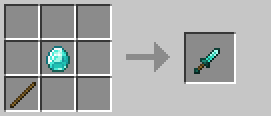

# Dao găm

Dao găm là vũ khí cận chiến với tỷ lệ chí mạng cao nhưng tầm tấn công ngắn, phù hợp cho lối chơi assassin.

### Công thức chế tạo

## Thông số cơ bản

| Thuộc tính | Giá trị |
|------------|---------|
| **Tỷ lệ chí mạng** | +20% |
| **Tầm tấn công** | -1.0 |
| **Sát thương cơ bản** | 4.0 (+1/cấp độ) |
| **Tốc độ tấn công** | 1.8 |

## Sát thương theo cấp độ vật liệu

| Cấp độ | Vật liệu | Sát thương cơ bản |
|--------|----------|-------------------|
| **0** | Gỗ / Vàng | 4.0 |
| **1** | Đá | 5.0 |
| **2** | Sắt | 6.0 |
| **3** | Kim cương | 7.0 |
| **4** | Netherite | 8.0 |