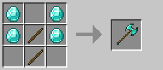

# Rìu chiến lớn

Rìu chiến lớn là vũ khí chậm nhưng có sát thương cực cao, đặc biệt phù hợp cho những ai thích lối chơi tấn công mạnh.

### Công thức chế tạo

## Thông số cơ bản

| Thuộc tính | Giá trị |
|------------|---------|
| **Tỷ lệ chí mạng** | +20% |
| **Sát thương cơ bản** | 9.0 (+1.5/cấp độ) |
| **Tốc độ tấn công** | 0.5 |

## Sát thương theo cấp độ vật liệu

| Cấp độ | Vật liệu | Sát thương |
|--------|----------|------------|
| **0** | Gỗ / Vàng | 9.0 |
| **1** | Đá | 10.5 |
| **2** | Sắt | 12.0 |
| **3** | Kim cương | 13.5 |
| **4** | Netherite | 15.0 |