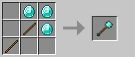

# Chùy gai

Chùy gai (trước đây gọi là maces) là vũ khí nhanh với khả năng stun, phù hợp cho lối chơi tấn công liên tục.

### Công thức chế tạo

## Thông số cơ bản

| Thuộc tính | Giá trị |
|------------|---------|
| **Tỷ lệ stun** | +20% |
| **Sát thương tấn công** | 1.0 |
| **Sát thương bludgeoning** | 2.5 (+1/cấp độ) |
| **Tốc độ tấn công** | 1.6 |

:::info Lưu ý về sát thương
Sát thương tấn công 1.0 là bắt buộc để vũ khí có thể gây sát thương. Điều này có nghĩa là tổng sát thương thực tế là 3.5 chứ không phải 2.5.
:::

## Sát thương theo cấp độ vật liệu

| Cấp độ | Vật liệu | Sát thương Bludgeoning | Tổng sát thương |
|--------|----------|------------------------|-----------------|
| **0** | Gỗ / Vàng | 2.5 | 3.5 |
| **1** | Đá | 3.5 | 4.5 |
| **2** | Sắt | 4.5 | 5.5 |
| **3** | Kim cương | 5.5 | 6.5 |
| **4** | Netherite | 6.5 | 7.5 |
