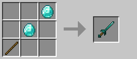

# Kiếm thọc

Kiếm thọc là vũ khí nhanh chuyên xuyên giáp với khả năng giảm miễn nhiễm của đối thủ.

### Công thức chế tạo

## Thông số cơ bản

| Thuộc tính | Giá trị |
|------------|---------|
| **Xuyên giáp** | +30% |
| **Giảm miễn nhiễm** | +50% |
| **Knockback** | -200% |
| **Sát thương cơ bản** | 2.0 (+0.5/cấp độ) |
| **Tốc độ tấn công** | 4.0 |

## Sát thương theo cấp độ vật liệu

| Cấp độ | Vật liệu | Sát thương cơ bản |
|--------|----------|-------------------|
| **0** | Gỗ / Vàng | 2.0 |
| **1** | Đá | 2.5 |
| **2** | Sắt | 3.0 |
| **3** | Kim cương | 3.5 |
| **4** | Netherite | 4.0 |