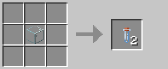
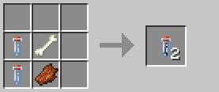
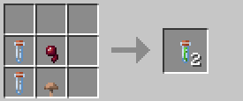
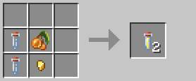
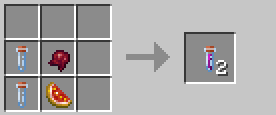

# Lọ thuốc

Lọ thuốc là các vật phẩm đặc biệt có thể ném hoặc áp dụng lên vũ khí để tạo hiệu ứng, yêu cầu mở khóa kỹ năng Etching Venom.

## Yêu cầu

:::warning Yêu cầu kỹ năng
Để chế tạo lọ thuốc, bạn cần mở khóa kỹ năng **Etching Venom** trong cây kỹ năng **Giả kim thuật**.
:::

## Lọ thủy tinh 🍶

Lọ thủy tinh là thành phần cơ bản để chế tạo các loại lọ thuốc khác.

### Công thức chế tạo

---

## Lọ thuốc thối 🤢

Lọ thuốc có thể ném hoặc áp dụng lên vũ khí để gây hiệu ứng giảm hồi máu.

### Công thức chế tạo

### Hiệu ứng
- **Giảm hồi máu**: Giảm 50% khả năng hồi máu
- **Cách sử dụng**: Ném hoặc áp dụng lên vũ khí

---

## Lọ thuốc độc 💚

Lọ thuốc gây hiệu ứng poison khi ném hoặc áp dụng lên vũ khí.

### Công thức chế tạo

### Hiệu ứng
- **Poison**: Độc I trong 30 giây (0:30)
- **Cách sử dụng**: Ném hoặc áp dụng lên vũ khí

---

## Lọ thuốc thánh 🌟

Lọ thuốc gây sát thương bức xạ tức thì, đặc biệt hiệu quả chống undead.

### Công thức chế tạo

### Hiệu ứng
- **Sát thương Radiant**: 6.0 sát thương bức xạ tức thì
- **Cách sử dụng**: Ném hoặc áp dụng lên vũ khí

---

## Lọ thuốc đau đớn 💀

Lọ thuốc gây sát thương magic tức thì.

### Công thức chế tạo

### Hiệu ứng
- **Sát thương Magic**: 4.0 sát thương
- **Cách sử dụng**: Ném hoặc áp dụng lên vũ khí