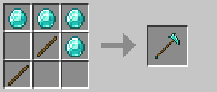

# Búa chiến

Búa chiến là vũ khí chuyên gây sát thương liên tục với khả năng knockback và stun mạnh mẽ.

### Công thức chế tạo

## Thông số cơ bản

| Thuộc tính | Giá trị |
|------------|---------|
| **Knockback** | +50% |
| **Tỷ lệ stun** | +20% |
| **Sát thương tấn công** | 1.0 |
| **Sát thương liên tục** | 6.0 (+1/cấp độ) |
| **Tốc độ tấn công** | 1.0 |

:::info Lưu ý về sát thương
Sát thương tấn công 1.0 là bắt buộc để vũ khí có thể gây sát thương. Điều này có nghĩa là tổng sát thương thực tế là 7.0 chứ không phải 6.0.
:::

## Sát thương theo cấp độ vật liệu

| Cấp độ | Vật liệu | Sát thương liên tục | Tổng sát thương |
|--------|----------|------------------------|-----------------|
| **0** | Gỗ / Vàng | 6.0 | 7.0 |
| **1** | Đá | 7.0 | 8.0 |
| **2** | Sắt | 8.0 | 9.0 |
| **3** | Kim cương | 9.0 | 10.0 |
| **4** | Netherite | 10.0 | 11.0 |