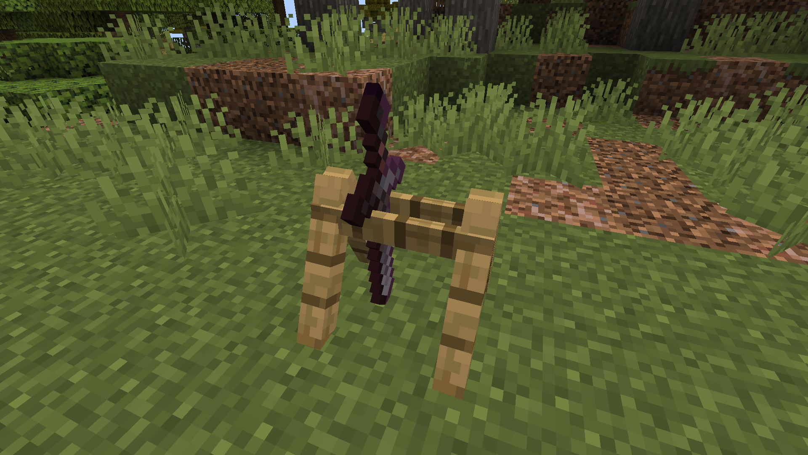
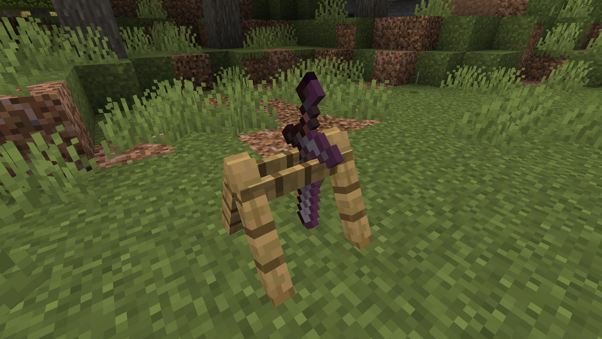
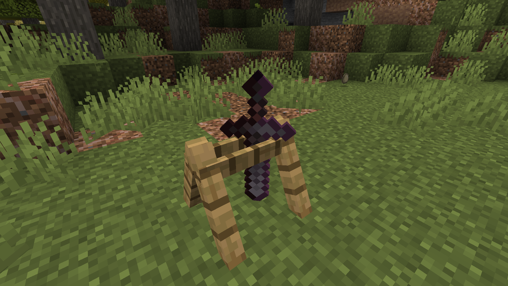
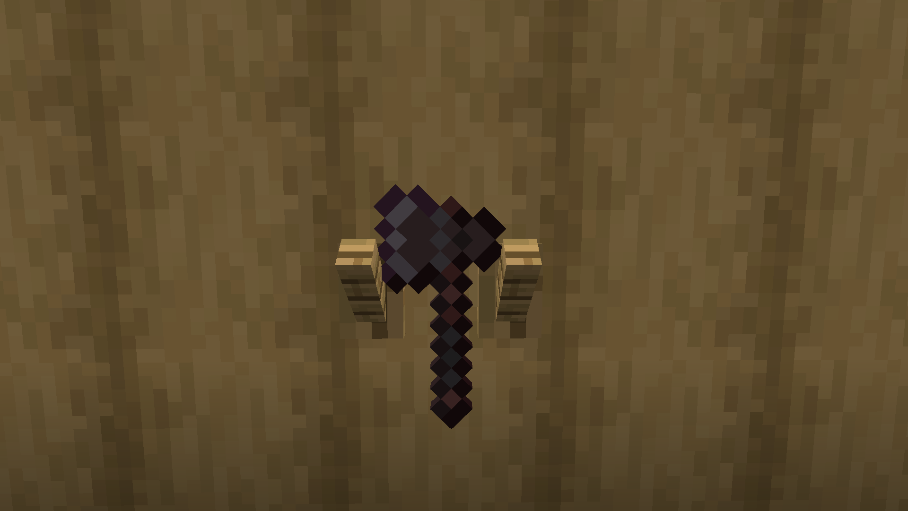

# Giá treo dụng cụ

---

## Giới thiệu

**Giá treo dụng cụ** là những block đặc biệt giúp bạn trang trí nơi ở và _flex_ vũ khí hay dụng cụ bạn có. Ngoài ra nó cũng có thể dùng để đựng lên tới **2** dụng cụ khác nhau

---

## Cách chế tạo

:::note Ghi chú
Có đủ **tất cả** những loại giá treo cho tất cả các loại gỗ
:::

Những nguyên liệu cần để chế tạo giá treo đồ rất đơn giản với:

- **3x** Ván gỗ loại bất kì
- **2x** Que gỗ

## Cách sử dụng

<h3> 1. **Đặt** giá treo xuống đất hoặc trên tường </h3>

<h3> 2. **Chuột phải** dụng cụ bạn muốn để lên giá treo </h3>

:::tip Mẹo
Vị trí bạn click có ảnh hưởng đến vị trí vật phẩm được đặt.

Thường thì giá treo đồ có 2 slot để treo dụng cụ: 1 bên **trái** và bên **phải** (Trừ một số trường hợp như khi treo khiên, dụng cụ treo trên giá treo trên tường)

 
:::

<h3> 3. **Shift + Chuột phải** vào từng món đồ được treo để chiều chỉnh hướng xoay/kiểu treo </h3>

